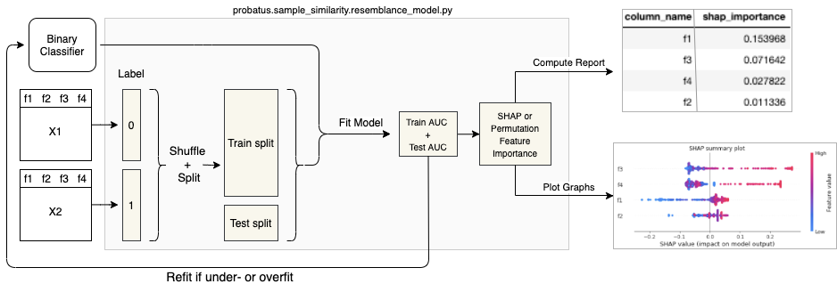

# Dataset

The goal of dataset module is understanding how different two samples are from a multivariate perspective.

One of the ways to indicate this is Resemblance Model. Having two datasets -  say X1 and X2 - one can analyse how easy it is to recognize which dataset a randomly selected row comes from. The Resemblance model assigns label 0 to the dataset X1, and label 1 to X2 and trains a binary classification model to predict which sample a given row comes from.
By looking at the test AUC, one can conclude that the samples have a different distribution if the AUC is significantly higher than 0.5. Furthermore, by analysing feature importance one can understand which of the features have predictive power.

## Overview

The sample similarity module provides sophisticated tools for analyzing and comparing multivariate datasets using machine learning approaches. This module is particularly valuable for:

- Detecting distribution shifts between datasets
- Identifying features that contribute to dataset differences
- Understanding data drift in production environments
- Validating data quality and consistency
- Supporting data monitoring and maintenance

### Key Components

#### SHAPImportanceResemblance (Recommended)
- Leverages SHAP (SHapley Additive exPlanations) for feature importance analysis
- Key features:
  - Tree-based model interpretation
  - Detailed feature importance analysis
  - Support for complex feature interactions
  - Comprehensive visualization options
  - Integration with scikit-learn's API

#### PermutationImportanceResemblance
- Uses permutation feature importance for analysis
- Key features:
  - Direct measurement of feature impact on AUC
  - Simple and interpretable results
  - Robust to feature interactions
  - Efficient computation
  - Clear feature ranking

### Features
- Multiple analysis approaches:
  - SHAP-based importance (recommended for detailed analysis)
  - Permutation-based importance (faster for initial screening)
- Comprehensive model support:
  - Binary classification models
  - Tree-based algorithms
  - Custom model integration
- Advanced analysis capabilities:
  - Feature importance ranking
  - Distribution shift detection
  - Feature interaction analysis
- Detailed reporting and visualization:
  - Feature importance plots
  - Performance metrics
  - Distribution comparisons

### Use Cases
- Data drift detection
- Feature importance analysis
- Dataset comparison
- Quality assurance
- Production monitoring
- Data validation

The module is designed to provide robust tools for understanding and comparing multivariate datasets, with a focus on interpretability and practical application.

The following features are implemented:

- [SHAPImportanceResemblance (Recommended)][probatus.dataset.resemblance_modeler.SHAPImportanceResemblance]:
  The class applies SHAP library, in order to interpret the tree based resemblance model.
- [PermutationImportanceResemblance][probatus.dataset.resemblance_modeler.PermutationImportanceResemblance]:
  The class applies permutation feature importance in order to understand which features the current model relies on the most. The higher the importance of the feature, the more a given feature possibly differs in X2 compared to X1. The importance indicates how much the test AUC drops if a given feature is permuted.

## Implemetation

::: probatus.dataset.resemblance_modeler

