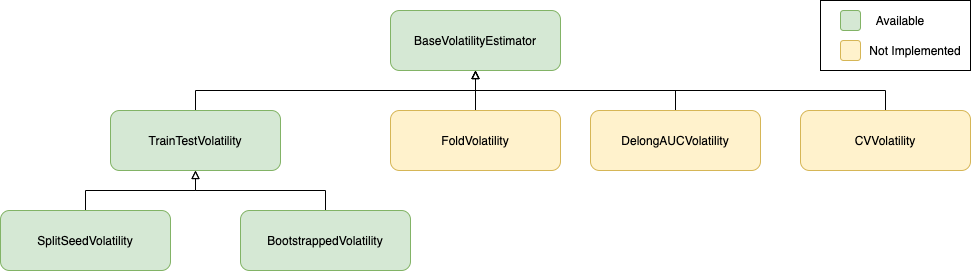

Metric Volatility
====================================

The schema below presents the class architecture of volatility estimators:

The following features are and will be implemented:

- **BaseVolatilityEstimator** - Base class, provides main functionality with fit method that can be overwritten by subclasses

   - **TrainTestVolatility** - Estimation of volatility of metrics. The estimation is done by splitting the data into train and test multiple times and training and scoring a model based on these metrics.

      - **SplitSeedVolatility** - Estimates volatility of metrics based on splitting the data into train and test sets multiple times randomly, each time with different seed.

      - **BootstrappedVolatility** - stimates volatility of metrics based on splitting the data into train and test with static seed, and bootstrapping train and test set.

- **FoldVolatility** - Splits data into train and test set. Then the train test is further split into n folds and the volatility of model trained on each fold separately is estimated on the test set.

- **DelongAUCVolatility** - Volatility estimation of AUC based on DeLong's algorithm.

- **CVVolatility** - Estimation of volatility metrics based on repeated Cross-Validation

probatus.metric\_volatility module
----------------------------------------------

.. automodule:: probatus.metric_volatility.volatility
    :members:
    :undoc-members:
    :show-inheritance:
